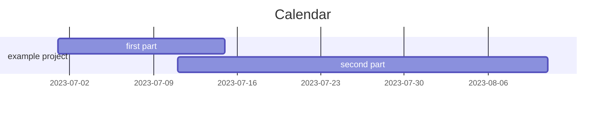

%% week: [[2023-W29]] %%



---
# daily tasks
---
# open tasks
%%tasks that remained incomplete from previous daily notes%%
```dataview 
TASK FROM #journal/daily   
WHERE !completed AND date < this.date
SORT due asc, text asc
GROUP BY tag
```
---
# reading list
%% list three recently modified papers with high priority %%
```dataview
TABLE WITHOUT ID first_author AS "first author", file.link AS "File", year, journal, rating 
FROM #paper/toread AND !"archive" AND !"calendar" AND !"templates"
SORT rating ASC, file.mday DESC
LIMIT 3
```
---
# paper of the day
%%displays papers that have been created or modified today%%
```dataview
TABLE WITHOUT ID first_author AS "author", file.link AS "File", year, journal, rating 
FROM #paper AND !"archive" AND !"calendar" AND !"templates"
WHERE this.date = file.cday OR this.date = file.mday
```

---
# daily activity
