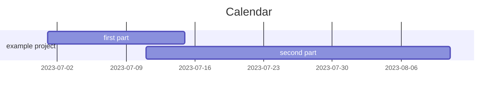

# agenda

--- 
# weekly summary session
---
# tasks 
%% tasks with due date %%
```dataview 
TASK FROM #journal/daily   
WHERE !completed AND due
```
%% tasks without due date%%
```dataview 
TASK FROM #journal/daily   
WHERE !completed AND !due
SORT due asc, text asc
GROUP BY tag
```
---
# daily journal
```dataview 
TABLE file.cday AS "created" 
FROM #journal/daily AND ([[]] OR outgoing([[]]))
SORT file.name desc 
```
